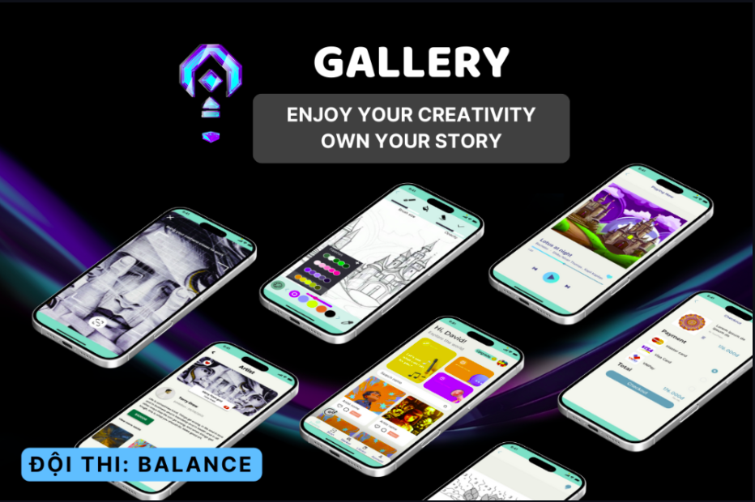

# Gallery | Enjoy your creativity own your story

This README provides an overview of the Bara project and its design, which is based on the Figma design available
[here](https://www.figma.com/design/aFQzPyVQKqF8aCgwWPCkkl/Ideathon?node-id=3-40&t=jSEdIJqwIMR9VwRh-1)



## Installation
To install and run the Bara project, follow these steps:

1. Clone the repository: `git clone https://github.com/giunzz/Gallery`
2. Navigate to the project directory:  `cd frontend`
3. Run ```npm install```
4. Start the development server: ```npm start```
